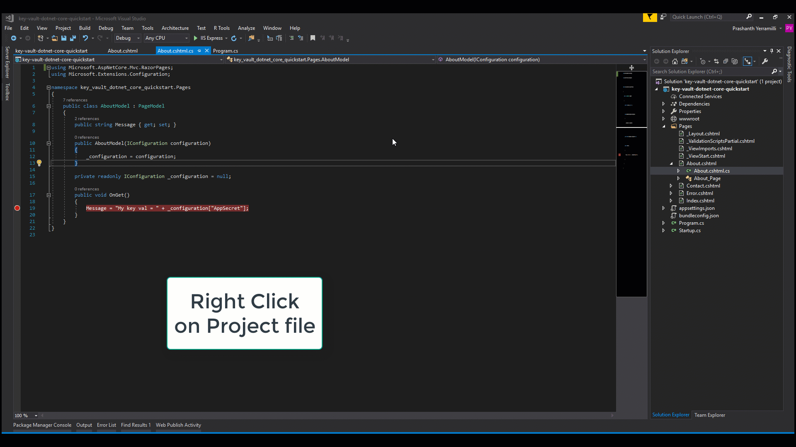

# Getting Started with Azure Key Vault with .NET Core
This sample demonstrates how to get started with Key Vault in .NET with Visual Studio Installed

This project allows you to 
- Create a Key Vault in Azure Key Vault
- Create a Web App on Azure Key Vault
- Enable Managed Service Identity for your web app
- Store and retrieve a secret from Azure Key Vault

## Getting Started

### Prerequisites
- On Windows
    * [Visual Studio 2017 version 15.7.3 or later](https://www.microsoft.com/net/download/windows)
        with the following workloads:
        - ASP.NET and web development
        - .NET Core cross-platform development
    * [.NET Core 2.1 SDK or later](https://www.microsoft.com/net/download/windows)
- On Mac 
    * https://visualstudio.microsoft.com/vs/mac/
* [Git](https://www.git-scm.com/)
    * Please download git from [here](https://git-scm.com/downloads).
* [Azure CLI](https://docs.microsoft.com/en-us/cli/azure/install-azure-cli?view=azure-cli-latest)
    * For the purpose of this tutorial we would work with Azure CLI version 2.0.4 or later which is available for Windows, Mac and Linux

### Quickstart

#### 1) Login to Azure
   To log in to the Azure using the CLI, you can type:

```azurecli
az login
```

#### 2) Create resource group

Create a resource group with the [az group create](/cli/azure/group#az_group_create) command. An Azure resource group is a logical container into which Azure resources are deployed and managed.

Please select a Resource Group name and fill in the placeholder.
The following example creates a resource group named *<YourResourceGroupName>* in the *eastus* location.

```azurecli
# To list locations: az account list-locations --output table
az group create --name "<YourResourceGroupName>" --location "East US"
```

The resource group you just created is used throughout this tutorial.

#### 3) Create an Azure Key Vault

Next you create a Key Vault in the resource group created in the previous step. Although “ContosoKeyVault” is used as the name for the Key Vault throughout this tutorial, you have to use a unique name. Provide the following information:

* Vault name - **Please Select a Key Vault Name here**.
* Resource group name - **Please Select a Resource Group Name here**.
* The location - **East US**.

```azurecli
az keyvault create --name "<YourKeyVaultName>" --resource-group "<YourResourceGroupName>" --location "East US"
```
At this point, your Azure account is the only one authorized to perform any operations on this new vault.


#### 4) Add a secret to key vault

We're adding a secret to help illustrate how this works. You could be storing a SQL connection string or any other information that you need to keep securely but make available to your application. In this tutorial, the password will be called **AppSecret** and will store the value of **MySecret** in it.

Type the commands below to create a secret in Key Vault called **AppSecret** that will store the value **MySecret**:

```azurecli
az keyvault secret set --vault-name "" --name "AppSecret" --value "MySecret"
```

To view the value contained in the secret as plain text:

```azurecli
az keyvault secret show --name "AppSecret" --vault-name "ContosoKeyVault"
```

This command shows the secret information including the URI. After completing these steps, you should have a URI to a secret in an Azure Key Vault. Make note of this information. You need it in a later step.

#### 5) Clone the Repo
    ```
     git clone https://github.com/Azure-Samples/key-vault-dotnet-core-quickstart.git
    ```

#### 6) Open and Edit the solution 
    Open the key-vault-dotnet-core-quickstart.sln file in Visual Studio 2017

    Open Program.cs file and update the placeholder <YourKeyVaultName> with the name of your Key Vault that you created in Step 3

#### 7) Run the app
    From the main menu of Visual Studio 2017, choose 
    Debug > Start without Debugging. 
    When the browser appears, navigate to the About page. The value for the AppSecret is displayed.

#### 8) Publish the web application to Azure

1. In Visual Studio, select **key-vault-dotnet-core-quickstart** Project.
2. Select **Publish** then **Start**.
3. Create a new **App Service**, select **Publish**.
4. Change the App Name to be "keyvaultdotnetcorequickstart"
5. Select **Create**.


#### 8) Enable Managed Service Identity
Azure Key Vault provides a way to securely store credentials and other keys and secrets, but your code needs to authenticate to Key Vault to retrieve them. Managed Service Identity (MSI) makes solving this problem simpler by giving Azure services an automatically managed identity in Azure Active Directory (Azure AD). You can use this identity to authenticate to any service that supports Azure AD authentication, including Key Vault, without having any credentials in your code.

1. Return to the Azure CLI
2. Run the assign-identity command to create the identity for this application:

```azurecli
az webapp identity assign --name "keyvaultdotnetcorequickstart" --resource-group "<YourResourceGroupName>"
```

>[!NOTE]
>This command is the equivalent of going to the portal and switching **Managed service identity** to **On** in the web application properties.

#### 9) Assign permissions to your application to read secrets from Key Vault
1. Return to the Azure CLI
2. Run the following command by replacing the placeholders
   ```
   az webapp identity assign --name "keyvaultdotnetcorequickstart" --resource-group "<YourResourceGroupName>"
   ```

Make a note of the output for the command above. It should be of format
    ```json
    {
      "principalId": "xxxxxxxx-xxxx-xxxx-xxxx-xxxxxxxxxxxx",
      "tenantId": "xxxxxxxx-xxxx-xxxx-xxxx-xxxxxxxxxxxx",
      "type": "SystemAssigned"
    }
    ```
Run this command next with the PrincipalId copied
    ```
    az keyvault set-policy --name '<YourKeyVaultName>' --spn <PrincipalId> --secret-permissions get
    ```

## Resources
- [Azure Key Vault Home Page](https://azure.microsoft.com/en-us/services/key-vault/)
- [Azure Key Vault Documentation](https://docs.microsoft.com/en-us/azure/key-vault/)
- [Azure SDK For .NET](https://github.com/Azure/azure-sdk-for-net)
- [Azure REST API Reference](https://docs.microsoft.com/en-us/rest/api/keyvault/?redirectedfrom=AzureSamples)
